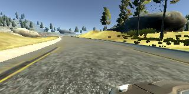
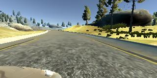
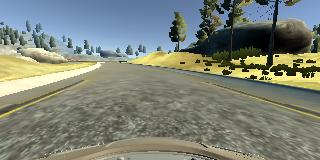

# Behavioral Cloning Project

Overview
---
The goal of the Behavioral Cloning Project is to train simulator data so that it can drive the car around the track in "autonomous mode". The main steps are  as follows:

1. Run the simulator in Training Mode.  Record both full length trips around the track, along with selective recordings of certain scenarios.

2. Using the Keras deep learning framework, develop a convolutional neural network (CNN) model for analyzing the data.

3. Train the model using simulator data created in step #1.  The model can then be used to run the simulator in autonomous mode.

4. Run the simulator in autonomous mode, using the model created in step #3. 

Approach
---
I used the following steps to create the CNN:

1. Start with 2 basic sets of training data; 1 full lap around the Easy Track going forward and 1 full lap around the Easy Track going backwards.

2. Develop the CNN, first with some basic features and then add various suggested features provided in the classroom.

3. Add additional training data, including recordings specific to going around curves in a steady manner and "recovering" from curves.

Overview of Model Architecture
---
I started by recreating the nVidia model that was suggested in the classroom.  I then added various features such as normalization using the Keras Lamda function, cropping and Dropout.  I also used the ELU activation function.

My final model includes 3 5x5 convolutional layers and 1 3x3 convolutional layer. This is followed by 3 Fully Connected Layers.

I used the Adam optimizer.  While I did try various options in hopes of improving performance, I ended up using the default parameters with the MSE loss function.

Loading and Preprocessing the Data
---
I utilized all 3 image angles provided by the simulator; center, left and right.  I adjusted the left and right images by +0.25 and -0.25 respectively.

I also converted the color space from RGB to YUV and added a Gaussian blur.

The following are samples of images created by the simulator:

Left

Center

Right

Creation of Training Dataset
---
Using the approach suggested in class, my final training data included the following:

1. 2 full laps on the easy track of driving as close to the middle of the road as possible.

2. 1 full lap going backwards on the easy track of driving as close to the middle of the road as possible.

3. Various recordings of driving around curves.  I recorded these on the easy track. 

4. Select short recordings of recovering from sides of the road. I recorded these on the easy track. 

While I originally included training data from the hard track, I ended up pulling that data in order to reduce the total amount of data for efficiency purposes.  I would have enjoyed trying to get my model to work on the hard track, but ran out of time.

One mistake that I made in creating the training data was creating too many "recovery" scenarios.  This resulted in the car swerving left and right way too much.  I remedied the situation by simply removing half of that particular set of training data.

My final set of training data included 10,986 rows of data.

